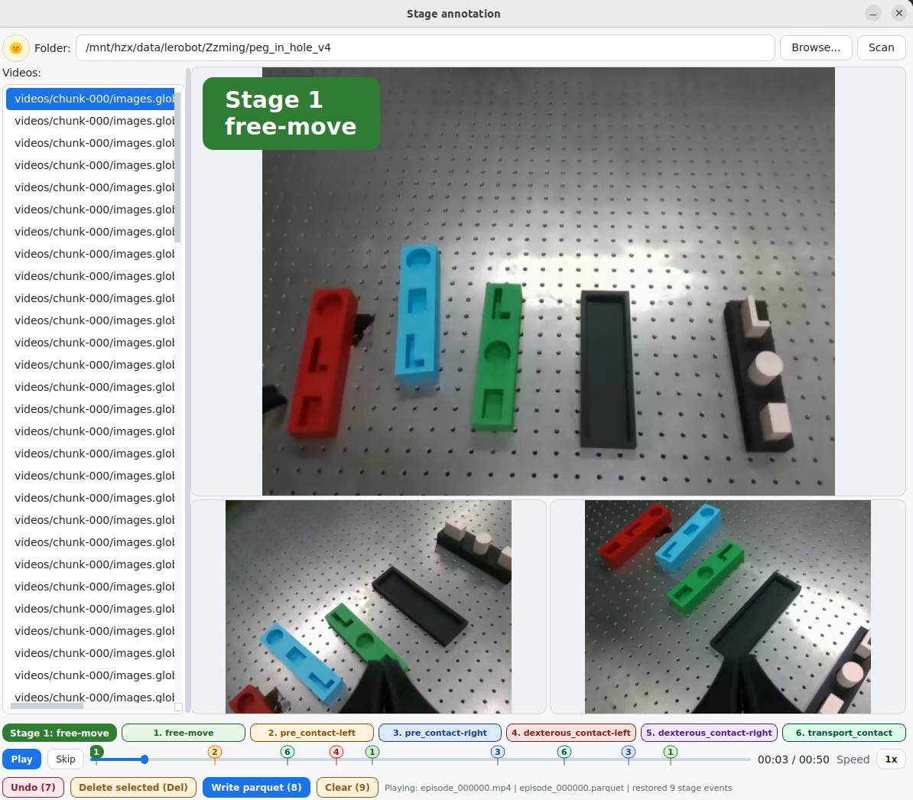

# Pattern training

Train a router that predicts the manipulation stage, active camera, and stage
progress. Run commands from the repository root after [installation](../SETUP.md).
Configuration files live in [configs/pattern](../configs/pattern).
Source code lives in the root [pattern](../pattern) directory. Install from the
repository root with `python -m pip install --no-deps -e .`, then use the module
commands below.

## Prepare the data

Each LeRobot dataset needs these files, with aligned video frames and parquet rows:

```text
dataset/
  meta/info.json
  data/chunk-000/episode_000000.parquet
  videos/chunk-000/images.global/episode_000000.mp4
  videos/chunk-000/images.left_wrist/episode_000000.mp4
  videos/chunk-000/images.right_wrist/episode_000000.mp4
```

Parquet columns: `state` (14 values), `effort` (14 values), and `stage_id_gt`
(integer IDs 1–6). Progress targets are computed from contiguous stage segments;
a separate progress annotation is not needed. The default model uses the current
three camera images and a 12-frame state/effort history.
Use at least two episodes so the training and validation splits are nonempty.

| Stage ID | Stage | Default active camera |
| --- | --- | --- |
| 1 | `free_move` | global |
| 2 / 3 | `pre_contact` | left / right wrist |
| 4 / 5 | `dexterous_contact` | left / right wrist |
| 6 | `transport_contact` | global |

Keep label meanings consistent across training datasets and serving configs.
Some task configs override camera routes; check the selected task before mixing data.

Label `stage_id_gt` as described below. About 50 hand-labeled episodes per task
is enough to train a first router; do not pre-annotate progress.

## Annotate stage labels

The GUI needs a local display (a desktop session, or SSH with X11 / Wayland
forwarding). It will not open on a headless GPU box. Install PyQt5 if the
environment does not already have it (`pip install PyQt5`). The tool also
needs `ffmpeg` / `ffprobe` on `PATH`.

### Seed labels in the GUI

From the repository root:

```bash
python -m pattern.annotation.pattern_annotation
```

Browse or type the LeRobot dataset root (or its `videos/` directory) and click
**Scan**. The list shows global-camera episode videos; the matching wrist
videos and parquet file are resolved automatically. For each task, label about
50 episodes, then train.



| Key | Action |
| --- | --- |
| `1`–`6` | Set the stage at the current frame |
| `Space` | Play / pause |
| `←` / `→` | Seek |
| `↑` / `↓` | Previous / next video |
| `Delete` | Remove the selected marker |
| `7` | Undo (annotate mode) |
| `8` | Write `stage_id_gt` into the episode parquet |
| `9` | Clear markers (annotate mode) |

`8` backs up the parquet once as `*.parquet.bak` if that backup does not
already exist. Markers are stage *changes*; the writer fills every parquet row
from the last marker.

Restrict the first training run to those seed episodes with
`dataset.sources[].num_episodes: 50`.

### Predict the rest, then review

After the seed router looks usable, write `stage_id_gt` onto the remaining
episodes:

```bash
python -m pattern.annotation.predict_data \
  --dataset-root /absolute/path/to/lerobot_dataset \
  --checkpoint outputs/pattern/my_run/best.pt
```

Pass `--episodes 50,51,52` (comma-separated ids) so the script does not
overwrite the hand-labeled seed. Omit `--episodes` only when you intend to
relabel the whole dataset. `--dry-run` runs inference without writing parquet.

Then correct the predictions in review mode:

```bash
python -m pattern.annotation.pattern_annotation --mode review
```

Review loads existing `stage_id_gt`, uses the same `1`–`6` / `Delete` keys, and
writes with `8` or `Ctrl+S`. Re-train (or fine-tune) on the corrected set.

The annotation GUI lives in
[`pattern/annotation/pattern_annotation.py`](../pattern/annotation/pattern_annotation.py).
The predict command lives in
[`pattern/annotation/predict_data.py`](../pattern/annotation/predict_data.py).

## Train

Copy a YAML from [`configs/pattern`](../configs/pattern) and override paths.
[`train_manipulation_pattern_joint.yaml`](../configs/pattern/train_manipulation_pattern_joint.yaml)
is the multi-task reference; the `train_*.yaml` files are single-task. Nested
maps merge; lists replace. Keep `model` as supplied for Piper data.

Videos are decoded on the fly (no `.pt` cache). The loader knob is
`dataset.streaming_decode_chunk_size`. Batch size, workers, LR, and GPUs are in
the YAML: `gpu_ids` selects physical devices; omit it to use `device`.

```yaml
extends: train_manipulation_pattern_joint
dataset:
  sources:
    - task: sorting
      root: /absolute/path/to/lerobot_dataset
train:
  output_dir: outputs/pattern/my_run
```

```bash
CUDA_VISIBLE_DEVICES=0 python -m pattern.train --config configs/pattern/my_train.yaml
```

Each source needs a unique `task` name (a split id, not a `configs/tasks/` name).
`num_episodes: null` uses the full dataset. Relative `root` paths resolve against
the YAML; relative `train.output_dir` uses the working directory.

## Evaluate

Training writes `best.pt` (best val stage accuracy), `last.pt`, `epoch_*.pt`,
`split.json`, and `low_dim_stats.npz` under `train.output_dir`. Keep `split.json`
with the checkpoint. Remaining eval fields are in
[`eval.yaml`](../configs/pattern/eval.yaml).

For a joint checkpoint, `dataset.task` must be one of the training source names;
evaluation uses that source's saved val episodes unless you set `eval.episodes`.

```yaml
extends: eval
checkpoint: outputs/pattern/my_run/best.pt
dataset:
  task: sorting
  root: /absolute/path/to/lerobot_dataset
eval:
  output_dir: outputs/pattern/my_run/eval
```

```bash
CUDA_VISIBLE_DEVICES=0 python -m pattern.evaluation.evaluate --config configs/pattern/my_eval.yaml
```

Online serving: set `stage_source.predict.checkpoint` in an
[inference config](data_and_inference.md#online-inference).
